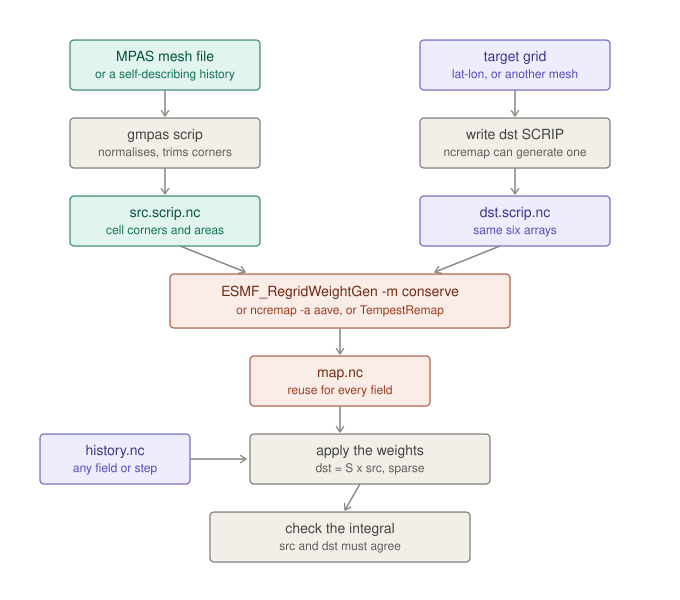
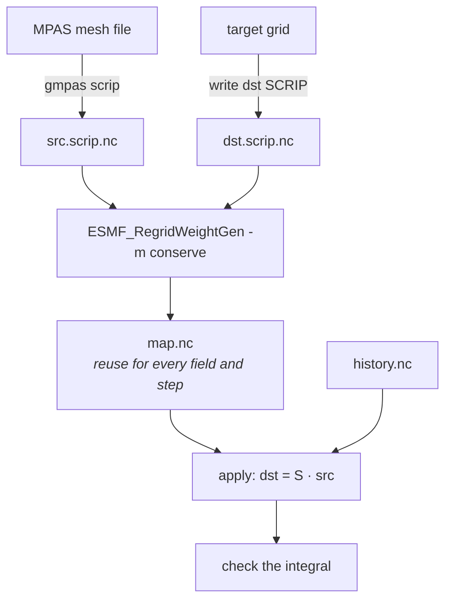

# Conservative remapping

A terminal workflow. gmpas writes the grid file and checks the answer; a real
remapper computes the weights.

## What you need installed

`ESMF_RegridWeightGen` (from `esmf`) and, optionally, `ncremap` (from `nco`).
Both are executables rather than Python packages, so they cannot come from pip
and are not declared in `pyproject.toml`.

**gmpas does not install ESMF itself, on purpose.** `environment.yml` only
brings in `nco`. On an HPC site, load the site's own ESMF build instead —
`module load esmf` — rather than adding a conda-forge copy to this
environment: the site build is tuned for the local MPI/interconnect, and a
second copy here would compete with it on `PATH`/`LD_LIBRARY_PATH` rather than
help (see [issue 34](https://github.com/nmathewa/gmpas-lib/issues/34)). On a
machine with no module system, `conda install -c conda-forge esmf` into a
separate environment works fine — just don't add it to the one gmpas itself
runs in. A `command not found: ESMF_RegridWeightGen` means neither is loaded.





## Why gmpas does not compute the weights

Spherical polygon intersection — great-circle edges, degenerate cells, poles,
the antimeridian — is hard to get right, and ESMF and TempestRemap have both
been doing it correctly for years.

And the obvious shortcut does not work. Supersampling a target cell and
counting which source cells the samples land in **converges towards**
conservation as the sample count grows, with error falling as `1/sqrt(N)`, but
never actually preserves the cell integral. That is not conservation, and
shipping it under that name would be worse than not offering it.

## One command

Put `target_domain` next to the run, optionally `include_fields`,
`exclude_fields` and `mesh_file`, then:

```bash
gmpas remap 'history.*.nc' -o out/
```

It reads the configuration, builds the weights once (reusing `map_*.nc` if it
is already there), and writes **one output file per input file** — a few
hundred history files concatenated into a single netCDF would be unwieldy, and
one-in-one-out keeps the valid time in the filename.

```
[1/3] configuration from /scratch/run
        found   target_domain
        found   include_fields
        absent  exclude_fields
        found   mesh_file
  input : 193 file(s)
  mesh  : init.nc  (from mesh_file)
  target: 534 x 267 cells, lon 80.0 .. 160.0, lat -20.0 .. 20.0, 0.149813 deg
  fields: 20 selected of 119 available

[2/3] weights
  writing src.scrip.nc and dst.scrip.nc
    normalised 12,774 longitudes onto [0, 2pi)
  weights ready in 18.2 s (77 MB)

[3/3] remapping 193 file(s) -> out/
        not remapped — u: on nEdges — needs edge weights
        conservation error 0.0e+00 (0 is exact)
  [  1/193] history.2012-02-25_00.00.00.remap.nc  18 fields, 347 slabs, 5.7s, eta 18m
```

### Where the mesh comes from

MPAS output streams are user-configured, so a history file need not carry
`verticesOnCell` at all. The mesh is resolved in this order:

1. `--mesh` on the command line
2. a `mesh_file` in the config directory, holding one line: the path
3. the data file itself, if it is self-describing
4. a mesh sitting beside the data with a matching cell count

`mesh_file` is usually the right answer for a real run — set once, not passed
on every command.

### What cannot be remapped by cell weights

Cell weights carry cell fields. MPAS keeps velocity as `u` on edges and
vorticity on vertices, and those need their own weight files, so they are
reported rather than silently dropped:

```
        not remapped — u: on nEdges — needs edge weights
        not remapped — vorticity: on nVertices — needs vertex weights
```

For winds, `uReconstructZonal` / `uReconstructMeridional` are already at cell
centres and remap normally.

### Running it in parallel

Files are independent, so they convert in parallel:

```bash
gmpas remap 'history.*.nc' -o out/ -j 64
```

**Give `-j` explicitly.** Without it the worker count is detected — from
`SLURM_CPUS_PER_TASK`, the other schedulers' variables, then the process
affinity mask, and only then `os.cpu_count()` — which beats using the size of
the machine, but is still only as reliable as what the site sets. The command
always reports which source it used, and that line is worth reading:

```
  64 worker(s) (of 64 from SLURM_CPUS_PER_TASK)     detection worked
  1 worker(s) (of 1 from NCPUS)                     detection was misled
```

`NCPUS` in particular is set to `1` by some login profiles regardless of the
allocation, which silently pins a large job to one worker. `-j` overrides
whatever was detected:

```
  64 worker(s) (asked for 64; 1 available from NCPUS)
```

Measured on 8 files, 936 slabs, on a 10-core laptop:

| workers | wall | per file |
|---|---|---|
| 1 | 14 s | 1.73 s |
| 2 | 8 s | 1.01 s |
| 4 | 5 s | 0.65 s |
| 8 | 5 s | 0.58 s |

It flattens past the core count because the work is largely netCDF reads. On a
parallel filesystem the ceiling is I/O bandwidth rather than cores, so very
high `-j` will not keep scaling — worth measuring on a subset before
committing a whole run.

Under `fork` the weights are inherited copy-on-write rather than re-read, which
matters at high core counts: ~15 MB of index arrays re-loaded in 256 workers
would be several gigabytes of duplication for read-only data.

A file that fails is reported and the run continues; the exit status is
non-zero if any failed.

### A caveat on ESMF

ESMF 8.9.1 on macOS segfaults intermittently — measured at roughly **one run
in five** on byte-identical inputs that succeed the other four times. Weight
generation is a one-off, so `gmpas remap` retries up to four times and says so
when it does. A reproducible crash is different and usually means the padded
`grid_corners` problem below.

## The steps, individually

### 1. Write the source grid

```bash
gmpas scrip history.2012-02-25_12.00.00.nc -o src.scrip.nc
```

Works on any file carrying mesh information — an `init.nc`, a `*.grid.nc`, or
a history file that carries its own mesh. It reports the coverage as a sanity
check (a global mesh should say 100%) and tells you if any longitudes had to be
normalised.

### 2. Write the target grid

Describe it in a `target_domain` file beside the run:

```
nlat     = 267
nlon     = 534
startlat = -20.0
endlat   =  20.0
startlon =  80.0
endlon   = 160.0
```

`startlat`/`endlat` are the **domain edges** and `nlat` counts cells across
them, so the spacing is `(endlat - startlat) / nlat` and centres sit half a
cell inside each edge — the grid then covers exactly the box you asked for.

The extent is not fussy beyond that. Target cells falling outside the source
mesh come back unmapped, and a target narrower than the mesh simply crops;
both are expected. `gmpas target` prints the covered extent next to the
requested one so any shift is visible rather than assumed.

Then, from that directory:

```bash
gmpas target -o dst.scrip.nc
```

`gmpas target` reads the file from the working directory — no path needed —
reports the resulting grid, and writes the SCRIP. Pass a data file too and it
lists which fields would be remapped:

```bash
gmpas target history.2012-02-25_12.00.00.nc -o dst.scrip.nc
```

Cell areas are written as exact solid angles, `dlon x (sin(north) -
sin(south))`, not the `dlon x dlat x cos(lat)` approximation — a remapper
compares them against its own and the difference shows up as conservation
error.

`ncremap -g dst.scrip.nc -G latlon=180,360` will also generate a target, and
a SCRIP file is only six arrays if you would rather write one directly.

### Choosing fields

Two more optional files in the same directory, one variable name per line:

```
include_fields    remap only these
exclude_fields    remap everything but these
```

Blank lines, `#` comments and stray trailing spaces are all fine — these get
hand-edited. A name in **both** files is contradictory: **include wins**, and
a warning names the fields, because silently dropping something explicitly
asked for leaves output missing with nothing to explain it.

### 3. Generate the weights — once per mesh pair

```bash
ESMF_RegridWeightGen -s src.scrip.nc -d dst.scrip.nc -w map.nc \
    -m conserve --src_regional --dst_regional --ignore_unmapped
```

`--src_regional` / `--dst_regional` matter for a mesh that does not cover the
sphere; `--ignore_unmapped` lets destination cells outside the source domain
pass through unmapped rather than aborting.

Alternatives, all producing a SCRIP-format weight file:

```bash
ncremap -s src.scrip.nc -g dst.nc -m map.nc -a aave    # first-order, the E3SM route
GenerateOfflineMap --in_mesh a.g --out_mesh b.g --ov_mesh ov.g --out_map map.nc
```

`-m conserve` is first-order; `-m conserve2nd` is second-order and less
diffusive. TempestRemap adds higher order and `--mono` monotonicity.

**Weights depend only on the two grids.** Generate once, then reuse for every
variable, level and timestep of that run.

### 4. Apply them

A weight file carries `row`, `col`, `S`, plus `area_a`, `area_b`, `frac_a`,
`frac_b`. Applying it is a sparse matrix multiply:

```python
import numpy as np, xarray as xr

w = xr.open_dataset("map.nc")
dst = np.zeros(w.sizes["n_b"])
np.add.at(dst, w.row.values - 1, w.S.values * src[w.col.values - 1])
```

The `- 1` is not optional: SCRIP indices are 1-based.

`ncremap` will also do this for you:

```bash
ncremap -m map.nc history.nc remapped.nc
```

### 5. Check that it conserved

The step worth never skipping, because every failure mode here produces a
plausible-looking wrong answer rather than an error:

```python
I_src = (src * w.area_a.values * w.frac_a.values).sum()
I_dst = (dst * w.area_b.values).sum()
assert abs(I_dst - I_src) / abs(I_src) < 1e-12
```

**Do not multiply the destination by `frac_b`.** With ESMF's default
`norm_type=dstarea` the weights already carry the destination coverage
fraction, so multiplying again double counts it — that mistake reported a 0.2%
error on weights that were exact.

Measured on a 413,788-cell regional mesh to a 0.25° lat-lon grid:

| field | relative error |
|---|---|
| constant 1.0 | 1.1e-16 |
| smooth analytic (float64) | 0.0 |
| `precipw`, `t2m` | 0.0 |
| nearest-neighbour, for contrast | 2.1e-05 |

For partially covered destination cells, the raw `dst` is what conserves;
`dst / frac_b` is what you plot.

## Two traps specific to MPAS

Both were found by testing, and both break `mpas_tools` output as readily as
anything else. `gmpas scrip` handles both.

### Files mix longitude conventions

A real history file stored `lonCell` on `[0, 2π)` reaching 3.23 rad (185°E)
while storing `lonVertex` on `[-π, π)` — so 12,774 vertices near the dateline
were negative. A cell's centre and its own corners then sit on different
branches, and the polygon handed to a remapper is nonsense.
`mpas_tools.scrip.from_mpas` refuses such a file outright:

```
ValueError: lonVertex is not in the desired range (0, 2pi)
```

`gmpas scrip` normalises onto `[0, 2π)` and reports how many values it moved.

### grid_corners must be trimmed

MPAS declares `maxEdges` generously — one mesh declares 10 and uses at most 6.
Written at the declared width, every unused column becomes a degenerate corner
repeated on every cell, and **ESMF 8.9.1 segfaults on `-m conserve`**:

```
exit 139, no weight file, nothing useful in the log
```

Confirmed at 2°, 1° and 0.25° targets; nearest-neighbour works either way, so
it is specific to the conservative path. Trimmed to 6 it completes. `gmpas
scrip` writes `grid_corners = max(nEdgesOnCell)`.

## What is not here

Applying weights from the command line is not implemented — see
[issue 2](https://github.com/nmathewa/gmpas-lib/issues/2). The snippet above is
what it would do.

`uxarray` is not yet an option: its remapping is nearest-neighbour, inverse
distance and bilinear only. Conservative exists through its YAC backend, but
that integration is still in progress.
