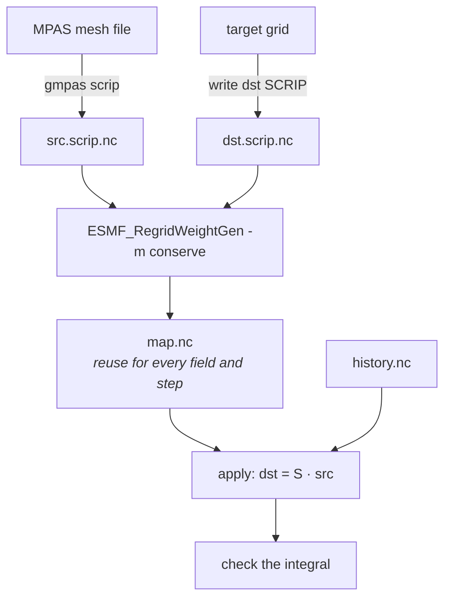

# Conservative remapping

A terminal workflow. gmpas writes the grid file and checks the answer; a real
remapper computes the weights.




## Why gmpas does not compute the weights

Spherical polygon intersection — great-circle edges, degenerate cells, poles,
the antimeridian — is hard to get right, and ESMF and TempestRemap have both
been doing it correctly for years.

And the obvious shortcut does not work. Supersampling a target cell and
counting which source cells the samples land in **converges towards**
conservation as the sample count grows, with error falling as `1/sqrt(N)`, but
never actually preserves the cell integral. That is not conservation, and
shipping it under that name would be worse than not offering it.

## The workflow

### 1. Write the source grid

```bash
gmpas scrip history.2012-02-25_12.00.00.nc -o src.scrip.nc
```

Works on any file carrying mesh information — an `init.nc`, a `*.grid.nc`, or
a history file that carries its own mesh. It reports the coverage as a sanity
check (a global mesh should say 100%) and tells you if any longitudes had to be
normalised.

### 2. Write the target grid

For a regular lat-lon target, `ncremap` can generate one:

```bash
ncremap -g dst.scrip.nc -G latlon=180,360
```

Or write it directly — a SCRIP file is six arrays, and for a rectilinear grid
the corners and areas are analytic.

### 3. Generate the weights — once per mesh pair

```bash
ESMF_RegridWeightGen -s src.scrip.nc -d dst.scrip.nc -w map.nc \
    -m conserve --src_regional --dst_regional --ignore_unmapped
```

`--src_regional` / `--dst_regional` matter for a mesh that does not cover the
sphere; `--ignore_unmapped` lets destination cells outside the source domain
pass through unmapped rather than aborting.

Alternatives, all producing a SCRIP-format weight file:

```bash
ncremap -s src.scrip.nc -g dst.nc -m map.nc -a aave    # first-order, the E3SM route
GenerateOfflineMap --in_mesh a.g --out_mesh b.g --ov_mesh ov.g --out_map map.nc
```

`-m conserve` is first-order; `-m conserve2nd` is second-order and less
diffusive. TempestRemap adds higher order and `--mono` monotonicity.

**Weights depend only on the two grids.** Generate once, then reuse for every
variable, level and timestep of that run.

### 4. Apply them

A weight file carries `row`, `col`, `S`, plus `area_a`, `area_b`, `frac_a`,
`frac_b`. Applying it is a sparse matrix multiply:

```python
import numpy as np, xarray as xr

w = xr.open_dataset("map.nc")
dst = np.zeros(w.sizes["n_b"])
np.add.at(dst, w.row.values - 1, w.S.values * src[w.col.values - 1])
```

The `- 1` is not optional: SCRIP indices are 1-based.

`ncremap` will also do this for you:

```bash
ncremap -m map.nc history.nc remapped.nc
```

### 5. Check that it conserved

The step worth never skipping, because every failure mode here produces a
plausible-looking wrong answer rather than an error:

```python
I_src = (src * w.area_a.values * w.frac_a.values).sum()
I_dst = (dst * w.area_b.values).sum()
assert abs(I_dst - I_src) / abs(I_src) < 1e-12
```

**Do not multiply the destination by `frac_b`.** With ESMF's default
`norm_type=dstarea` the weights already carry the destination coverage
fraction, so multiplying again double counts it — that mistake reported a 0.2%
error on weights that were exact.

Measured on a 413,788-cell regional mesh to a 0.25° lat-lon grid:

| field | relative error |
|---|---|
| constant 1.0 | 1.1e-16 |
| smooth analytic (float64) | 0.0 |
| `precipw`, `t2m` | 0.0 |
| nearest-neighbour, for contrast | 2.1e-05 |

For partially covered destination cells, the raw `dst` is what conserves;
`dst / frac_b` is what you plot.

## Two traps specific to MPAS

Both were found by testing, and both break `mpas_tools` output as readily as
anything else. `gmpas scrip` handles both.

### Files mix longitude conventions

A real history file stored `lonCell` on `[0, 2π)` reaching 3.23 rad (185°E)
while storing `lonVertex` on `[-π, π)` — so 12,774 vertices near the dateline
were negative. A cell's centre and its own corners then sit on different
branches, and the polygon handed to a remapper is nonsense.
`mpas_tools.scrip.from_mpas` refuses such a file outright:

```
ValueError: lonVertex is not in the desired range (0, 2pi)
```

`gmpas scrip` normalises onto `[0, 2π)` and reports how many values it moved.

### grid_corners must be trimmed

MPAS declares `maxEdges` generously — one mesh declares 10 and uses at most 6.
Written at the declared width, every unused column becomes a degenerate corner
repeated on every cell, and **ESMF 8.9.1 segfaults on `-m conserve`**:

```
exit 139, no weight file, nothing useful in the log
```

Confirmed at 2°, 1° and 0.25° targets; nearest-neighbour works either way, so
it is specific to the conservative path. Trimmed to 6 it completes. `gmpas
scrip` writes `grid_corners = max(nEdgesOnCell)`.

## What is not here

Applying weights from the command line is not implemented — see
[issue 2](https://github.com/nmathewa/gmpas-lib/issues/2). The snippet above is
what it would do.

`uxarray` is not yet an option: its remapping is nearest-neighbour, inverse
distance and bilinear only. Conservative exists through its YAC backend, but
that integration is still in progress.
