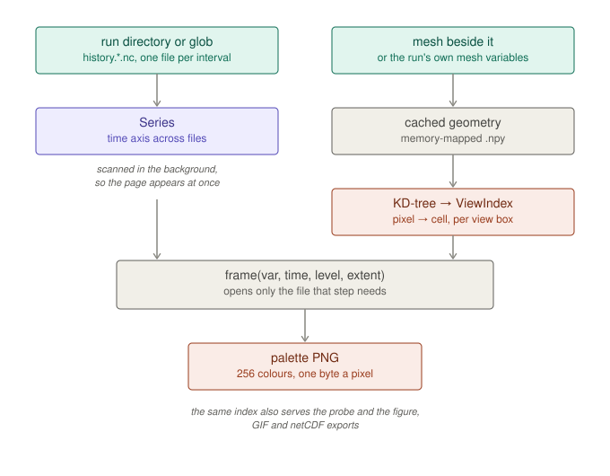

# Command line

```bash
gmpas info       history.2012-02-25_12.00.00.nc
gmpas plot       history.2012-02-25_12.00.00.nc precipw -o pw.png
gmpas view       /path/to/run/
gmpas scrip      history.2012-02-25_12.00.00.nc -o src.scrip.nc
gmpas target     -o dst.scrip.nc
gmpas prep view  mesh.nc
gmpas prep hfun  hfun.py
gmpas prep generate hfun.py -o mesh/
gmpas prep scale mesh.nc --scale-factor 2.0 --tan-lat 0 --tan-lon 125
gmpas prep relocate mesh.nc --tan-lat 40 --tan-lon 280
gmpas prep create-region mesh.nc --polygon 40,-129 50,-129 50,-65 40,-65
```

`info` summarises the mesh and lists variables grouped by the element they
live on. `plot` renders one field. `view` opens the interactive browser.



A run is opened as a `Series` across however many files it spans, scanned in
the background so the page appears immediately. The mesh beside it goes through
the same cached geometry and KD-tree as `prep view`. Each request names a
variable, timestep, level and view box; only the file holding that step is
opened, and the values are gathered through the view index straight into a
palette PNG.
`scrip` and `target` prepare the two grid files a conservative remapper needs
— see [Conservative remapping](./remapping.md).

Everything above except `prep` is **postprocessing**: it opens a run and
renders, remaps or exports it. `prep` is the other end of the pipeline, for
work that happens before there is any output — see
[Preprocessing](./preprocessing.md).

Running `gmpas` with no arguments prints the whole list with examples.

Every command takes a file, a directory, or a glob. A directory or glob is
read as one time series across files, which is how MPAS actually writes
output — one `history.YYYY-MM-DD_HH.MM.SS.nc` per interval:

```bash
gmpas plot '/path/to/run/history.*.nc' precipw --all-steps -o 'frames/pw_{step:04d}.png' -j 8
```

`--all-steps` needs `{step}` in the output pattern; `-j` sets the worker count
(default: every core). Useful flags on `plot`: `-t/--time`, `-l/--level`,
`--cmap`, `--extent`, `--symmetric` for anomalies, `--method poly|raster|auto`,
`--style paper|poster|notebook|mesh`.
