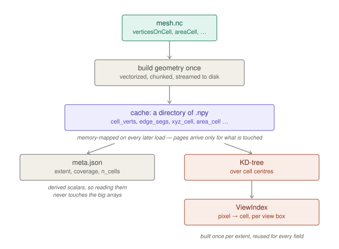
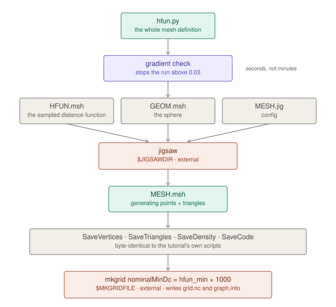
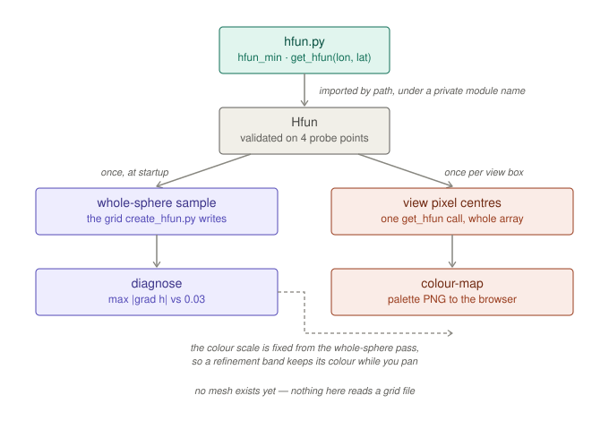

# Preprocessing

The rest of gmpas opens a run. `gmpas prep` covers what happens before one
exists — building a mesh and looking at it on its own.

```bash
gmpas prep view mesh.nc
```

A browser view of a mesh file with no output data anywhere near it: cells
coloured by width, so where the mesh refines is visible at a glance.

```
8,228 cells, 24,987 edges, regional — cell width 43 to 68.1 km
listening on 127.0.0.1:8765 — this machine only
```



The geometry is built once and cached as a directory of `.npy`, then
memory-mapped on every later load, so pages arrive only for the arrays
something actually touches. `meta.json` carries the derived scalars — extent,
coverage, cell count — so reading them never pulls in the largest array. The
KD-tree turns each view box into a pixel-to-cell index once, and every field
and every frame at that extent is then a gather.

Same flags as `view` for tunnelling and size: `-p/--port`, `--host`,
`--width`, `--height`, `--no-browser`. On a compute node use `--host 0.0.0.0`
and tunnel, exactly as for `view`.

Two fields are offered, both derived from geometry the mesh cache already
holds, so neither costs a rebuild: `cell_width_km` (the default) and
`cell_area_km2`.

**The colour scale is fixed**, taken once from the whole mesh rather than
autoscaled to the current view. There is no vmin/vmax control to put it back,
and that is the point: a scale that restretched as you panned would make the
same refinement band change colour while you moved across it, which misreads a
variable-resolution mesh badly.

The layout is the `view` page reduced to what a preprocessing step uses. The
timestep and level sliders, the colormap picker, the colour-range boxes, the
animation panel, the exports and the probe all belong to a model run, so they
are absent rather than disabled. Pan, zoom, graticule, scale bar and the
extent box stay — the last because reading a domain off a mesh is how one
picks a region.

`prep.layout.page(title, panel=..., script=...)` is that layout as a reusable
shell, with slots for a step's own controls. The sidebar's facts block is
data-driven — a step sends `subtitle` and `stats`, so one with no cells or
edges reuses the shell rather than forking it. `prep hfun` is the second user;
mesh generation is meant to be the third
([issue 15](https://github.com/nmathewa/gmpas-lib/issues/15)); like the
remapping tools, JIGSAW would be an external executable gmpas shells out to,
not a Python dependency.

### One server, one port

A run, the mesh it is on, and the distance function behind that mesh are the
three things one wants side by side, and they used to be three processes on
three ports — three SSH tunnels from a compute node. They are now one:

```bash
gmpas view /path/to/run/ --hfun hfun.py     # data + mesh + hfun
gmpas prep view mesh.nc --hfun hfun.py      # mesh + hfun
gmpas prep hfun hfun.py --mesh mesh.nc      # hfun + mesh
```

```
2 sources on one port:
  /mesh  mesh — maritime.region.nc · 8,228 cells
  /hfun  hfun — hfun.py · 12 to 60 km · gradient 0.0300
```

`/` lists what is available and each page carries a switcher, so one tunnel
reaches all of them. Opening a run gives the mesh page for free — a run always
brings its mesh with it. Every source is constructed before the server binds,
so a bad path is an error at the prompt rather than a 500 in a browser tab.

A single source is unchanged: it is served at the root, with no index and no
switcher, on exactly the paths it always used.

### Generating a mesh with JIGSAW

```bash
export JIGSAWDIR=/path/to/jigsaw/build/src            # or .../bin
export MKGRIDFILE=/path/to/mpas_jigsaw_tutorial/mkgrid
gmpas prep generate hfun.py -o mesh/
```



One command from a distance function to an MPAS `grid.nc`:

```
  hfun_uniform.py: 120 to 120 km, max gradient 0.0000
  sampling hfun onto 334 x 167 (0.1M points)
  wrote GEOM.msh, HFUN.msh (0 MB) and MESH.jig
  running jigsaw — this is the slow part
  MESH.msh: 41,225 generating points, 82,446 triangles in 37.4 s
  SaveVertices (41,225) and SaveTriangles (82,446)
  SaveDensity (1 to 1)
  running mkgrid 120000 (nominalMinDc in metres = hfun_min * 1000)
  grid.nc: 41,225 cells (49 MB) in 0.4 s
```

Same division of labour as the remapping side: gmpas does not generate the mesh
itself, it prepares every input the external tools need, shells out, and reads
the result back.

#### Both executables are prerequisites

`$JIGSAWDIR` and `$MKGRIDFILE` must be set, or the run stops before it starts.
Either variable takes the executable itself or the directory holding it, and
`--jigsaw` / `--mkgrid` override them.

**There is deliberately no `PATH` fallback.** Both tools are built by hand into
a location of the builder's choosing — JIGSAW wherever `CMAKE_INSTALL_PREFIX`
pointed, `mkgrid` wherever the tutorial repository was cloned — so `PATH` is the
exception rather than the rule, and silently picking up some other binary of the
same name is a worse outcome than a sentence naming the variable to set.

Both are resolved **before any work**, because discovering that `mkgrid` is
missing after JIGSAW has run for five minutes helps nobody:

```
gmpas: $MKGRIDFILE is not set, so mkgrid cannot be run.
  It is mkgrid.c in the mini-tutorial repository, and has to be built:
    git clone https://github.com/mgduda/mpas_jigsaw_tutorial.git
    cd mpas_jigsaw_tutorial
    export PNETCDF=$(brew --prefix pnetcdf)   # or your PnetCDF prefix
    make                                      # needs mpicc
  then:
    export MKGRIDFILE=<path>/mpas_jigsaw_tutorial/mkgrid
  or pass --mkgrid.
```

`mkgrid` is not released anywhere on its own — it is `mkgrid.c` in the
[mini-tutorial repository](https://github.com/mgduda/mpas_jigsaw_tutorial),
built against MPI and PnetCDF. JIGSAW is also on conda-forge
(`conda install -c conda-forge jigsaw`) if you would rather not build it.

Use `--skip-mkgrid` to stop after the `Save*` files; `$MKGRIDFILE` is then not
needed.

#### What it writes

`HFUN.msh` is written the way `create_hfun.py` writes it — the same grid, the
same `meshgrid(lats, lons)` argument order, and therefore the same
longitude-major value ordering. Getting that order wrong would transpose the
distance function and refine the wrong part of the planet *without failing*, so
there is a test comparing the file back against the function elementwise.

`SaveVertices` and `SaveTriangles` carry the file's own tokens rather than
floats reformatted by us, so JIGSAW's precision survives and the triangle
indices stay exactly as written — 0-based, which is what `mkgrid` expects.
`SaveDensity` is MPAS's `meshDensity`, `(h_fine / h(x)) ** 4`, one value per
generating point. All three were checked **byte for byte** against the
tutorial's own scripts.

A real `MESH.msh` has a `POWER` block between `POINT` and `TRIA3` — per-point
weights for a power diagram — which `convert_jigsaw.py` skips only as a side
effect of its counter staying at the limit across those lines. gmpas dispatches
on section headers instead, so an unfamiliar block is ignored because it is
unfamiliar rather than by luck.

#### Checked before any time is spent

Generation takes minutes; measuring the gradient takes a second. A transition
steeper than the 0.03 guideline stops the run rather than producing a mesh you
would throw away:

```
gmpas: hfun.py has a maximum cell size gradient of 0.0501 at 41.2, -95.0,
above the 0.03 guideline. A mesh built from it will change cell size too
quickly to be well behaved.
  Widen the transition region, or raise hfun_min.
  Pass --allow-steep to generate it anyway.
```

`MESH.msh` and `grid.nc` are reused if already present, unless `--force`.
`--init` passes an initial point set through to `INIT_FILE`, which is what
gives a quasi-uniform mesh icosahedral structure — a constant `HFUN` alone
produces 7-sided cells.

#### A trap worth knowing

`MESH.jig` names `GEOM.msh` and `HFUN.msh` **relatively**, and JIGSAW resolves
those against its *working directory* — not the `.jig` file's directory, and not
the executable's. Measured:

| setup | result |
|---|---|
| cwd = the files' directory, binary called by absolute path | works |
| cwd elsewhere, `.jig` passed by absolute path | fails |
| cwd elsewhere, binary symlinked into cwd | fails |
| cwd elsewhere, absolute paths written inside `MESH.jig` | works |

gmpas always runs it in the output directory, so this cannot bite here. It is
recorded because it does bite when running JIGSAW by hand: it prints
`**parse error: file not found!` and exits 2.

### Rescaling a regional mesh

```bash
gmpas prep scale mesh.nc --scale-factor 2.0 --tan-lat 0 --tan-lon 125 -o scaled.nc
```

```
mesh.nc -> scaled.nc  (x2 around 0N, 125E)
comparison plot: scaled.compare.png
```

Projects every cell/vertex/edge stereographically onto the plane tangent at
`--tan-lat/--tan-lon`, divides by `--scale-factor`, and projects back —
values above 1 shrink cells (finer resolution), pulling the whole domain in
toward the tangent point rather than resizing cells within a fixed extent.
Everything derived from position (`dcEdge`, `dvEdge`, `areaCell`,
`areaTriangle`, `kiteAreasOnVertex`, `weightsOnEdge`, `angleEdge`,
`nominalMinDc`) is recomputed from the new coordinates. Ported from
MPAS-Tools' `scale_regional_mesh.py`; ordinary MPAS's own dual-mesh
formulas throughout (l'Huilier's theorem for spherical triangle area, the
usual spherical-trig angle formula), vectorized with numpy rather than a
per-cell/edge/vertex Python loop — the one exception is `weightsOnEdge`,
which walks each cell's edges in rotated order and stays a loop over edges
for that reason.

Always writes a new file at `-o/--out` (default `<mesh stem>.scaled.nc`);
`mesh.nc` is never touched.

#### Regional meshes only

The stereographic scale is only close to the requested factor **near the
tangent point**. Measured directly, with `--scale-factor 2.0`: at 60 degrees
away the local effect is already only ×1.63 instead of ×2; past 120 degrees
it flips to making cells **coarser** instead of finer; near the antipode of
the tangent point it converges on almost exactly the *reciprocal* of what
was asked for. Applied to a global mesh, this produces a mesh with one
hemisphere far too fine and the opposite one far too coarse — this is not a
bug, it's what dividing stereographic-projected coordinates by a constant
does far from the projection's own centre. `gmpas prep scale` warns before
doing the (much more expensive) recompute if the mesh reaches more than 45
degrees from the tangent point:

```
gmpas: mesh.nc reaches 174 degrees from the tangent point. gmpas prep scale
is a regional-mesh tool: its stereographic scale is only close to the
requested factor near the tangent point, and drifts -- past ~120 degrees it
starts making cells coarser instead of finer -- the farther out it goes.
See docs/preprocessing.md. To reposition a refined region without this
distortion, use gmpas prep relocate instead.
```

The warning doesn't block the run — the recompute still happens and the
file still writes, since there's no way to be sure a use past that
threshold is a mistake rather than intentional experimentation. If what you
actually want is to move a refined region to a new location, not resize it,
`gmpas prep relocate` (below) does that with zero distortion anywhere on
the sphere.

The actual gap this points at — gmpas has no way to crop a global mesh down
to a regional subset (what `create_region` does elsewhere in the MPAS
tooling), which is normally the step *before* a mesh is regional enough for
`scale` to behave well — is tracked as
[issue 52](https://github.com/nmathewa/gmpas-lib/issues/52).

#### Only a unit-sphere mesh

`gmpas prep scale` refuses a mesh whose `sphere_radius` isn't 1 — a mesh
straight out of JIGSAW/`mkgrid` (`gmpas prep generate`), not one that has
already been through `init_atmosphere`. The whole algorithm assumes `R = 1`;
running it on an Earth-scaled mesh would silently corrupt every coordinate,
so this is checked rather than assumed:

```
gmpas: mesh.nc has sphere_radius=6371229.0, not a unit sphere. gmpas prep
scale only supports a mesh straight off JIGSAW/mkgrid, before
init_atmosphere redimensionalizes it -- scaling a metres-scale mesh with
this formula would silently corrupt its coordinates.
```

#### Boundary cells

A regional mesh has cells/edges/vertices at its own boundary with no real
neighbour on one side (MPAS's 1-based, 0-fill connectivity). Anything that
would otherwise need a missing neighbour — `dcEdge` and `areaTriangle` at
the boundary, `kiteAreasOnVertex` where a vertex's own neighbours run out —
falls back to the old value scaled by `scale_factor` (or `scale_factor**2`
for an area) instead. `dvEdge` has no such case: every edge always has
exactly two vertices.

#### The comparison plot

By default, a successful scale also writes a before/after cell-width map —
two panels on one shared colour scale, so a resolution change and a domain
shift both show up at a glance, at `--plot-out` (default
`<out stem>.compare.png`). This is a quick sanity check, not a saved
artefact of the scale itself: pass `--no-plot` to skip it, which also skips
importing matplotlib/cartopy entirely, so `gmpas prep scale` still works
without the optional `plot` extra installed.

Unaffected by the topology this scale never touches: the mesh's cell
adjacency (`cellsOnCell`, `cellsOnEdge`, `verticesOnCell`, ...) passes
through byte-for-byte unchanged, since only geometry is recomputed. A
`graph.info` written by `gmpas prep generate` before scaling — and any
partition file `gpmetis` derived from it — stays valid for the scaled mesh
without regenerating either.

### Repositioning a refined region

```bash
gmpas prep relocate mesh.nc --tan-lat 40 --tan-lon 280 -o relocated.nc
```

```
mesh.nc -> relocated.nc  (its finest cell -> 40N, 280E)
```

Moves a mesh's refined region to a new location via a rigid rotation of the
sphere, rather than `scale`'s stereographic projection — a rotation is an
isometry, so it preserves every distance, area and angle exactly, with no
far-field distortion and no antipodal singularity anywhere. `dcEdge`,
`dvEdge`, `areaCell`, `areaTriangle`, `kiteAreasOnVertex`, `weightsOnEdge`
and `nominalMinDc` all come out **byte-for-byte unchanged**; only the
coordinates themselves and `angleEdge` (the edge-normal bearing relative to
local east on the fixed lat/lon grid, which does change when a point moves)
are recomputed. This is the tool for "I want the resolution pattern I
already have, just centred somewhere else" — `scale` is for "I want this
mesh's resolution to actually change," and only behaves well once the mesh
is already regional (close to the tangent point).

Unlike `scale`, this has no unit-sphere precondition — a rotation matrix
doesn't care what `sphere_radius` is — and it's safe to run directly on a
**global** mesh: rotate first, to bring the refined region to where a study
needs it, then crop to a regional subset once it's in the right place,
rather than the other way around.

#### The current centre

`--from-lat`/`--from-lon` name where the refined region currently sits;
left unset, it defaults to the mesh's own finest cell (minimum `areaCell`)
— the conventional single point of maximum refinement in an MPAS
variable-resolution mesh. Pass both explicitly for a mesh with more than
one refined patch, where auto-detection would only find one of them; the
two must be given together, or not at all.

### Cropping a global mesh to a region

```bash
gmpas prep create-region mesh.nc \
    --polygon 40,-129 50,-129 50,-65 40,-65 -o conus.region.nc
```

```
mesh.nc -> conus.region.nc  (4-point boundary)
partition file: conus.region.graph.info
```

The step this package was previously missing entirely
([gmpas-lib#52](https://github.com/nmathewa/gmpas-lib/issues/52)): going
from a global (or larger regional) mesh to the actual regional subset a
limited-area run uses. `--polygon` is a closed boundary as `lat,lon` pairs
in degrees, at least 3, in either winding order; `--point` names a point
known to be inside it and defaults to the polygon's spherical centroid,
which is only reliable for a convex (or near-convex) boundary — pass it
explicitly otherwise.

Every mesh cell inside the boundary is kept, plus 7 more rings of cells
grown outward beyond it — not part of what was asked for, but required for
the file to be usable: `init_atmosphere` and the atmosphere core relax the
forecast toward driving boundary data in those rings every step, most
strongly in the outermost 2 (the "specified" zone, overwritten directly)
and with decreasing weight through the next 5 (the "relaxation" zone). That
7-ring split (`N_SPEC_ZONE = 2`, `N_RELAX_ZONE = 5`) is not a tuning choice
made here — it is hardcoded in MPAS-Model's own
`mpas_atm_boundaries.F`/`mpas_init_atm_cases.F`, and `bdyMaskCell`'s value
at each kept cell (`0` for the untouched interior, up through `7` at the
outer edge) is a file-format contract with those routines, not an
implementation detail. `bdyMaskEdge`/`bdyMaskVertex` follow the more
interior (lower) of their adjoining cells' values.

An independent implementation, not a port — see the module docstring in
`gmpas/prep/region.py` for why: MPAS-Dev/MPAS-Limited-Area does the same
job but carries no LICENSE file, unlike MPAS-Tools (the source for `scale`
and `relocate`), which is permissively licensed. Built instead from graph
traversal over `cellsOnCell` and from MPAS-Model's own public
Registry.xml/Fortran source for the `bdyMaskCell` semantics above.

Since there is no `mkgrid` run over a cropped subset, `create-region` also
writes the accompanying `graph.info` `gpmetis` partition file itself, in
the same directory as the output mesh.

#### Concave regions

A concave boundary (or one spanning a pole, or a large longitude range, on
a `grid.nc`) can produce incorrect terrain during `init_atmosphere`'s
static-field interpolation — a property of that downstream interpolation
step, not of the cropping itself, but worth keeping in mind when drawing
`--polygon`. Prefer a convex boundary, or crop a `static.nc` (already past
that interpolation) instead.

### Looking at a mesh before it exists

```bash
gmpas prep hfun hfun.py            # browse it
gmpas prep hfun hfun.py --check    # just the numbers, no server
```

In the JIGSAW workflow for MPAS-Atmosphere, a variable-resolution mesh is
defined entirely by a small Python file. `create_hfun.py` samples it onto a
lat-lon grid to write `HFUN.msh`, JIGSAW turns that into generating points, and
`mkgrid` turns those into `grid.nc`. Every design decision lives in that one
file, so this reads it on its own — no JIGSAW, no mesh, no generation time:

```
hfun.py: hfun_min 12 km, grid distance 12 to 60 km
max cell size gradient 0.0300 at 75.64, -95.05 (within the 0.03 guideline)
measured on the 3336 x 1668 lat-lon grid create_hfun.py would write (12 km spacing)
```



The contract is the mini-tutorial's: a module-level `hfun_min` in km, and
`get_hfun(lon, lat)` taking **radians** and returning **km**. That function is
called once with whole arrays and may do expensive setup — a real one might
interpolate a raster — so it is called once per view here, never per pixel.

The whole-sphere pass at startup does double duty: it produces the gradient
measured against the guideline, and it fixes the colour limits, which is why a
refinement band keeps its colour while you pan.

**The gradient is the number worth having.** The tutorial's guidance is to keep
cell size changing by no more than a few percent per km of distance, with 0.03
generally safe, and `mesh_quality.py` reports exactly that from a finished
`grid.nc`:

```python
nominalDx = r_earth * nominalMinDc * (1.0 / meshDensity) ** 0.25
gradient  = abs(nominalDx[c0] - nominalDx[c1]) / dcEdge / r_earth
```

Since `meshDensity` is `(hfun_min / h) ** 4` and `nominalMinDc` is `hfun_min`,
that is the change in grid distance between neighbouring cells over the
distance between them. Its continuous limit is `|grad h|` with respect to arc
length, which is what is computed here — on the same lat-lon grid
`create_hfun.py` would write, so the number is comparable both to the 0.03
guideline and to what `mesh_quality.py` will say once the mesh exists. The two
polar rows are excluded: every longitude at a pole is the same point, so the
zonal derivative there is 0/0 rather than a gradient.

Two fields are offered, neither invented here: `cell_width_km` is `get_hfun`
straight out, and `mesh_density` is `(hfun_min / h) ** 4` — MPAS's own
`meshDensity`, 1.0 where the mesh is finest.

Nothing in `prep/` modifies the postprocessing path. It imports the viewer's
rasterizing, PNG encoding, coastline overlay and port binding, and changes
none of them.
